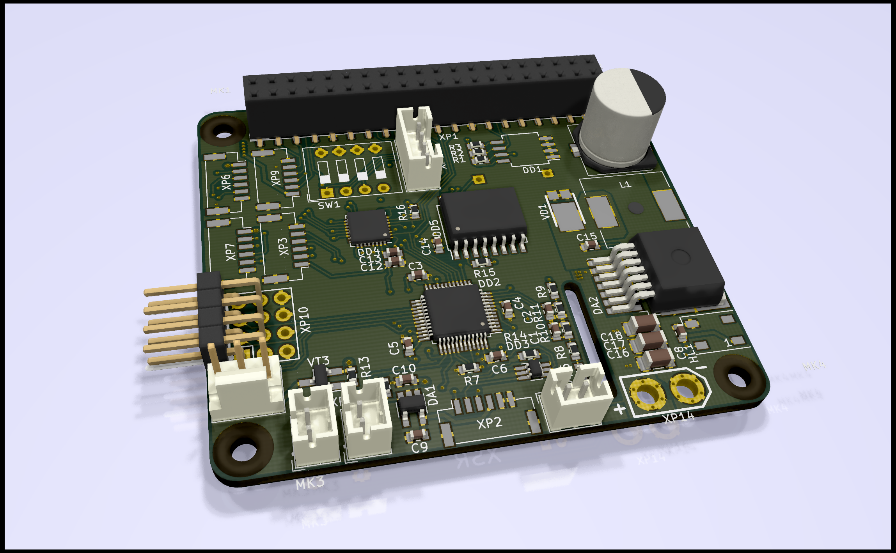

OBC Drone HAT
=============

I tired deal with built-in Raspberry Pi UART,
so decided to make my own HAT that incorporate all my requirements.

Initially I wanted to use Lattice XO2 FPGA to implement peripheral devices (hooked up via SPI).
But in months i'm not able to progress beyond LED blinker :).
So i returned to more known approach - use device ICs and MCUs.

Use cases
---------

1. Ground station:
   * Video receiver (wifi broadcast);
   * RFD900x telemetry logger and gateway;
   * RC bridge for FrSky D16 (Taranis).
2. Onboard computer
   * AP - Companion link with hardware flow control (RTS/CTS)

Modules
-------

1. UART chip - MAX3109 - provide two channels
2. RTC chip - DS3231 - to keep system time
3. RC bridge MCU - STM32F030CC - to decode S.BUS, generate CPPM, inject FrSky telemetry to S.Port.
4. Hi-power supply input (with optional Vbat mon up to 6S battery)
5. ID EEPROM with all needed DT-overlays.

HAT Version 1.0a
----------------

I ordered batch of PCB 21.04.2018, should receive in +1 mo.

Connectors:

- TELEM1 - MAX UART 0
- TELEM2 - MAX UART 1
- Raspberry Pi UART and I2C (same as Pixhawk 2 GPS2 port)
- STM debug port (not needed in normal conditions)
- 4x servo (in case if you want add Pan-Tilt on ground station)
- 5V FAN (with optional RPM input and PWM-able output)
- FrSky XSR connector (provide RC signals)
- CPPM out (muxed from XSR module and STM)
- XT30 power input, up to 30V (6S LiPo 25.2V), up to 25W
- 2x PH 5v power supply (if you need to power something)
- Config ID 3-bit switch (rotary switch for 8 positions, or individual DIP switch) - to select operation mode (config in EZ-WifiBroadcast).
